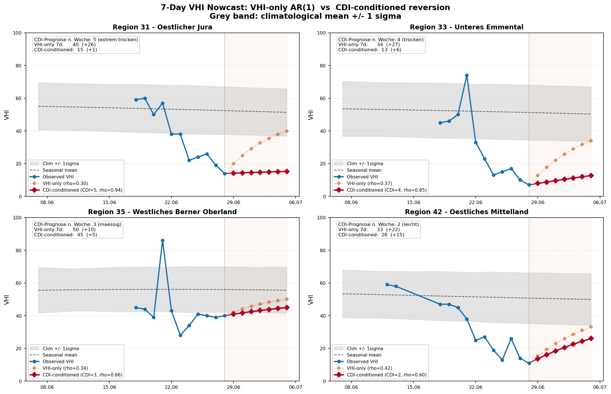
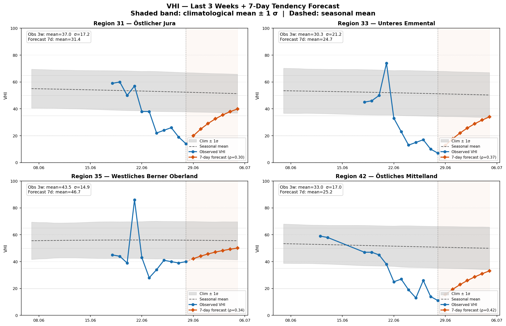

# Enhancement: VHI forecast - 7-day nowcast plus 2-to-4-week CDI-driven outlook

Label: enhancement

## Summary

This issue proposes adding a forward-looking vegetation-health capability to the
drought briefing. It does not replace any existing product. Cross-validation on
the weekly historic archive (1991 to 2025, 38 drought regions) reshaped the
original idea from a single 7-day model into two complementary products:

1. 7-day VHI nowcast: where the vegetation index is heading over the next week,
   driven mainly by VHI's own recent state.
2. 2-to-4-week VHI outlook: where vegetation is heading over the next month,
   driven by the CDI forecast. This is the genuinely new capability.

The split is not a design preference. It is what the data require: the source of
predictive skill changes with the forecast horizon (see Findings).

## Data foundation

All inputs already exist in the repository. No new external dependency.

- Weekly historic archive: data/raw/historic.zip -> weekly_historic_regions.csv,
  covering 1991 to 2025, 38 regions, with CDI and VHI aligned on the same weekly
  grid and the same region IDs (CDI id == VHI REGION_NR, so no spatial mapping
  is needed).
- Coverage: CDI 98 percent, SPI and precipitation indices about 100 percent,
  hydro index 98 percent, VHI 26 percent (sparse Landsat era pre-2017, dense
  Sentinel-2 era after). About 17,880 weeks have CDI and VHI paired.
- No circularity: the Swiss CDI combines precipitation, modelled soil moisture,
  and discharge or lake level. It contains no vegetation component, so using CDI
  to forecast VHI is a clean driver-to-response relationship, not vegetation
  predicting vegetation.
- The live CDI product (STAC collection ch.bafu.trockenheitsindex) publishes a
  per-region 4-week forecast (current week plus weeks 1 to 4), which is the
  operational input for the outlook product.

Note: the soil_moisture_index column is only 3 percent populated and is not
usable as a primary predictor.

## How the models work

7-day nowcast:

    VHI_hat(t+7) = Climatology(DOY+7) + rho_daily^h * Anomaly(t)  [+ additive current CDI]

- Climatology(DOY): Fourier harmonic regression (2 harmonics) fitted to the full
  VHI history, giving the normal seasonal curve.
- Anomaly(t): VHI(t) minus the seasonal normal (the current stress signal).
- rho_daily: per-day AR(1) anomaly decay, rho_7 ** (1/7). This makes the forecast
  path start at the last observed value and bend smoothly toward the seasonal
  mean, so there is no visual jump. The h=7 endpoint equals a plain lag-7
  anomaly-persistence model, so the validated skill is preserved while the path
  is continuous and mean-reverting.
- Optional additive current-CDI term gives a small extra skill gain and keeps the
  forecast directionally coherent (a dry CDI pulls the forecast down).

2-to-4-week outlook:

    VHI_anom(t+H) ~ Anomaly(t) + CDI_forecast(t+H) + Anomaly(t) * CDI_forecast(t+H)

- The interaction term Anomaly * CDI_forecast is the operational meaning of
  "stays dry, stays stressed": when a region is already stressed and the CDI
  forecast stays dry, the anomaly persists instead of reverting to normal; when
  the CDI forecast eases, recovery toward normal accelerates.

## Findings (leave-one-year-out cross-validation, 2017+, 38 regions)

Why the scope splits by horizon. Mean skill vs the VHI-only anomaly-persistence
model (M2). M3 = additive current CDI. M3* = additive with a perfect 1-week CDI
forecast (an upper bound).

| Horizon | M2 RMSE | +current CDI (M3) | +CDI forecast (M3*) |
|---|---|---|---|
| 7 days  | 11.41 | +2.2% | +1.4% |
| 14 days | 13.68 | +1.8% | +3.0% |
| 21 days | 13.55 | +1.3% | +4.6% |
| 28 days | 13.68 | +1.4% | +4.9% |

At 7 days, current CDI helps but the CDI forecast adds nothing over it, because
CDI barely moves in a week and VHI already encodes the drought state. At 2 to 4
weeks the CDI forecast becomes the dominant source of skill and keeps growing.

Testing the "CDI changes how fast VHI adapts" mechanism directly. Mean skill vs
M2. M5 = additive CDI forecast plus the Anomaly * CDI interaction. M6 = the
interaction alone with no additive level term.

| Model | 7d | 14d | 21d |
|---|---|---|---|
| M3 additive current CDI | +2.2% (34/38) | +1.8% (33/38) | +1.3% (30/38) |
| M5 CDI forecast + interaction | +0.9% (23/38) | +2.2% (30/38) | +3.7% (36/38) |
| M6 interaction only | -0.2% (12/38) | -0.3% (15/38) | -0.4% (13/38) |

The interaction mechanism is real, but only as a term on top of an additive CDI
level (M5), and only at 2 weeks and beyond. On its own (M6) it never beats
VHI-only. At 7 days it slightly overfits and loses to the simpler additive M3,
because vegetation is too slow to respond to next-week weather within a week. At
21 days M5 is the most robust result in the whole study (positive in 36 of 38
regions).

Recommended model by horizon:

| Horizon | Recommended model | Reason |
|---|---|---|
| 7 days | VHI Fourier + AR(1) with CDI-conditioned reversion rate (see next section) | Prevents physically implausible recovery when the CDI forecast stays dry |
| 14 to 28 days | VHI + CDI forecast + Anomaly * CDI interaction (M5) | CDI forecast dominates once VHI memory fades; interaction captures stays-dry-stays-stressed |

## Why the 7-day nowcast also needs the CDI forecast (conditional analysis)

Aggregate RMSE at 7 days suggested CDI adds little (about 2 percent), which argued
for a simple VHI-only nowcast. That conclusion was wrong, and aggregate RMSE
hid why. Conditioning on the regime that matters for a drought product reveals a
large, systematic error.

For stressed weeks (VHI anomaly below -10), 2017+, all 38 regions (n = 1923),
the observed 1-week VHI change depends strongly and monotonically on next-week
CDI:

| Next-week CDI | n | mean VHI change in 1 week | gap to normal closed |
|---|---|---|---|
| 5 extreme dry | 102 | +0.7 | 6% |
| 4 dry | 206 | +2.5 | 15% |
| 3 moderate | 329 | +6.1 | 34% |
| 2 | 409 | +6.9 | 40% |
| 1 normal | 877 | +10.6 | 63% |

Coarsely: a stressed region that stays dry (CDI >= 4) recovers +1.9 VHI (12
percent of the gap); one where drought eases (CDI <= 2) recovers +9.5 (55
percent). A near tenfold difference.

The plain AR(1) model applies a fixed reversion (rho about 0.3 to 0.4, roughly 60
percent recovery) regardless of CDI. In the stays-dry regime it therefore
forecasts a recovery of roughly +20 VHI in a week when the real value is about
+2. That is physically indefensible (vegetation does not recover 20 index points
in a week without rain and cooler temperatures), and the drought-persistence
regime is exactly the operationally important one for this product. The reason
aggregate RMSE missed it: stays-dry cases are only about 16 percent of stressed
weeks, so fixing them barely moves the global average even though the per-case
error is large.

Fix: make the 7-day reversion rate a function of the CDI forecast, calibrated
directly from the table above:

| Next-week CDI | recovery fraction | implied rho_7 |
|---|---|---|
| 5 | 0.06 | 0.94 |
| 4 | 0.15 | 0.85 |
| 3 | 0.34 | 0.66 |
| 2 | 0.40 | 0.60 |
| 1 | 0.63 | 0.37 |

so rho_effective = f(CDI_forecast): CDI 5 gives rho about 0.94 (the anomaly
barely reverts, VHI stays stressed), CDI 1 gives rho about 0.37 (strong
recovery). Worked example on the live 2026-06-28 forecast: Region 31 (Jura), CDI
forecast 5, VHI-only predicts 40 (+26) while CDI-conditioned predicts 15 (+1);
Region 42 (Mittelland), CDI forecast 2 (easing), CDI-conditioned predicts 26
(+15).

Faint dotted orange is the VHI-only AR(1) forecast; solid red is the
CDI-conditioned forecast. Region 31 (CDI forecast 5, extreme dry) stays flat
instead of jumping to 40; Region 42 (CDI forecast 2, easing) still recovers.

## VHI-only 7-day baseline (four focus regions, for reference)

Skill score greater than 0 means the model beats the baseline.

| Region | R2 fit | rho | RMSE persist | RMSE clim | RMSE model | SS vs persist | SS vs clim |
|---|---|---|---|---|---|---|---|
| 31 Oestlicher Jura | 0.081 | 0.30 | 17.9 | 16.0 | 14.8 | +0.18 | +0.09 |
| 33 Unteres Emmental | 0.083 | 0.37 | 17.5 | 16.8 | 15.1 | +0.11 | +0.11 |
| 35 Westl. Berner Oberland | 0.082 | 0.34 | 17.5 | 15.4 | 14.0 | +0.21 | +0.12 |
| 42 Oestliches Mittelland | 0.057 | 0.42 | 16.4 | 16.0 | 14.0 | +0.15 | +0.13 |

Note on the low R2: VHI is already a normalized index, so most of its variance is
anomaly by design. A low seasonal R2 means the climatology correctly isolates the
seasonal signal from the stress signal, not that the fit is poor.

Blue is the observed VHI over the last 3 weeks, orange is the 7-day AR(1)
forecast, the grey band is the climatological mean +/- 1 sigma.

## Proposed output in the briefing

7-day tendency, three classes (increasing stress, stable, decreasing stress):

> VHI-Tendenz (7 Tage): Zunehmender Vegetationsstress erwartet.
> Tendance VHI (7 jours): Augmentation du stress de la vegetation attendue.

2-to-4-week outlook, driven by the CDI forecast:

> VHI-Ausblick (2 bis 4 Wochen): Anhaltende Trockenheit, Erholung unwahrscheinlich.
> Perspective VHI (2 a 4 semaines): Secheresse persistante, reprise peu probable.

## Pros

- No new data dependency. Weekly historic archive and the live per-region CDI
  forecast already exist.
- No circularity. CDI is a pure meteo and hydro driver of vegetation.
- Transparent and lean. A handful of coefficients per region, storable in YAML.
  The lean models beat the kitchen-sink 6-driver stack, which overfit.
- Continuous and physically plausible 7-day path. Starts at the last observation
  and mean-reverts, matching how vegetation behaves.
- Fails gracefully. If VHI is missing, the anomaly term drops out and the
  forecast is the seasonal curve. If CDI is missing, the outlook falls back to
  VHI-only.
- Fits the architecture. Pipeline generates a forecast JSON, frontend consumes
  it, no calculation in the browser.

## Cons and risks

- Modest absolute skill. Gains are single-digit percentages over already-good
  baselines. Vegetation forecasting is hard. This is a tendency and outlook
  indicator, not a precise prediction.
- The 4.6 to 4.9 percent figures at 21 to 28 days use a perfect CDI forecast as
  an upper bound. The live CDI forecast has its own error, so real skill lands
  between the M3 and M3* columns.
- Small per-region samples. Roughly 200 paired weeks per region even in the dense
  era. Keep models lean. CDI as a single predictor beat the full driver stack.
- Region heterogeneity. The coupling helps most in drought-sensitive regions
  (54 to 59) and little in a few others. Consider a per-region on/off flag.
- Cloud gaps and staleness. A stale VHI observation degrades the nowcast. A
  staleness guard is needed (suppress and warn if the last VHI is more than about
  5 days old).
- Climate drift. The 1991 to 2025 climatology spans warming. Monitor whether the
  pooled baseline pulls normal toward stressed conditions.

## Prototype code (in prototypes/ folder, research code, not yet pipeline code)

- prototypes/vhi_tendency.py: Fourier climatology, AR(1) 7-day forecast, and the
  VHI-only cross-validation.
- prototypes/vhi_cdi_coupling.py: CDI coupling cross-validation (models M0 to M4*
  and the interaction models M5, M6) on the weekly historic archive.
- prototypes/vhi_plot.py: plotting for the 7-day nowcast figure.
- prototypes/vhi_plot_cdi.py: nowcast with CDI-conditioned reversion, overlaid
  against the VHI-only version, using the live per-region CDI forecast.
- prototypes/vhi_nowcast_7day.png: example VHI-only 7-day nowcast, four regions.
- prototypes/vhi_nowcast_cdi_compare.png: VHI-only vs CDI-conditioned nowcast,
  four regions, on the live 2026-06-28 forecast.

## Decision requested from steering committee

- Thumbs up: proceed. Suggested order: ship the 7-day nowcast first (lower risk),
  then build the 2-to-4-week CDI-driven outlook.
- Thumbs down: do not implement.
- Eyes: more information needed (comment with what is missing).

/cc @david-oesch
